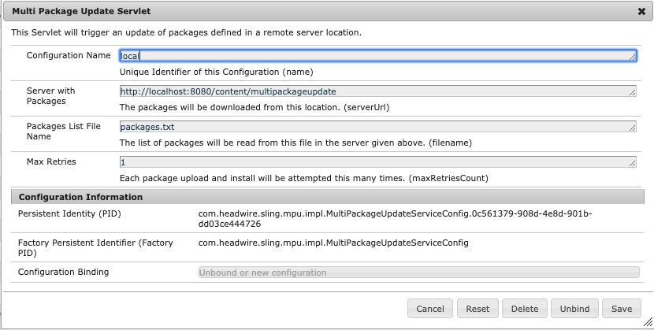

### Multi Package Update

#### Introduction

This project delivers a simple servlet mechanism to perform an installation of a given list of packages.

#### Usage

The servlets are exposed under [/bin/mpu](http://localhost:8080/bin/mpu.html) and are the following:
- [`/bin/mpu/start`](http://localhost:8080/bin/mpu/start.json): to trigger the multi-package update process,
- [`/bin/mpu/stop`](http://localhost:8080/bin/mpu/stop.json): to stop the current update thread
(if there is one running),
- [`/bin/mpu/status`](http://localhost:8080/bin/mpu/status.json):
to see the current status (if there is a thread running),
- [`/bin/mpu/log`](http://localhost:8080/bin/mpu/log.json): to check the last log message.

They are all available as both `json` and `html`.

#### Configuration

The main required configuration is that of
[com.headwire.sling.mpu.impl.MultiPackageUpdateService](http://localhost:8080/system/console/configMgr/com.headwire.sling.mpu.impl.MultiPackageUpdateService):

- **Server with Packages**: the full `URL` of the location of both packages and the listing file from below.
An example value could be `http://localhost:8080/content`,
- **Packages List File Name**: the name of a text file, located under the above path, containing
the list of packages names to be installed. An example value could be `packages.txt`,
- **Max Retries**: maximum number of retries to install a single package.

##### Service User Mapping

For the proper operation of the `servlet` one has to configure
[Sling Service User Mapper Service](http://localhost:8080/system/console/configMgr/org.apache.sling.serviceusermapping.impl.ServiceUserMapperImpl.amended)
to associate `com.headwire.sling.multipackageupdate:multipackageupdate` with the name of
a [System User](http://localhost:8080/bin/users.html/home/users/system/sling-multipackageupdate) with appropriate
privileges allowing for `package` upload and installation.

##### Packages List File

The packages list file is a simple text file containing packages names or `URL`s in each line, e.g.

    my-app-package-1.0.0.zip
    http://localhost:8080/content/multipackageupdate/my-content-package-1.0.0.zip
    https://localhost:8080/content/multipackageupdate/my-acl-package-1.0.0.zip

##### Sample Configuration

The module `ui.content` contains a full set of test files and configurations that should simply work upon installation of
the `package`. Right after calling [`/bin/mpu/start`](http://localhost:8080/bin/mpu/start.json) successfully one should be
able to see [/content/multipackageupdate/test.html](http://localhost:8080/content/multipackageupdate/test.html) page.

#### Build and Installation

The project is built quite simple:

    mvn clean install
    
To install the OSGi bundle use the profile `autoInstallBundle`:

    mvn clean install -P autoInstallBundle

To install the content together with the core bundle use the profile `autoInstallPackage`:

    mvn clean install -P autoInstallPackage

To install the sample configuration and content use the profile `autoInstallContentPackage`:

    mvn clean install -P autoInstallPackage

##### ATTENTION

It is probably best not to deploy the OSGi Bundle alone as this may lead to conflicts with the package deployment.

In case of a misshape the package and bundles needs to be uninstalled manually:

1. Remove [`/apps/multipackageupdate/install`](http://localhost:8080/bin/browser.html/apps/multipackageupdate/install) folder,
2. Uninstall the package using [the package manager](http://localhost:8080/bin/packages.html),
3. Remove the package from [`/etc/packages`](http://localhost:8080/bin/browser.html/etc/packages) including the snapshots
if they are still there,
4. Remove [the Bundle](http://localhost:8080/system/console/bundles/com.headwire.sling.multipackageupdate) using
the [OSGi Console](http://localhost:8080/system/console/bundles).

